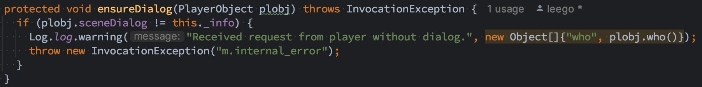
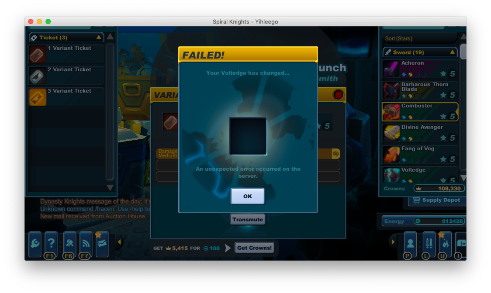

# PocketShop

Enter commands to call shops anytime and anywhere.

- Enter `/ah` to call the Auction House.
- ~~Enter `/uv` or `/punch` to call the Punch.~~
- ~~Enter `/unbind` or `/vice` to call the Vice.~~
- ~~Enter `/accessory` to call the Bechamel.~~
- ~~Enter `/harness` to call the Bechamel.~~

They even check the dialogs, which causes exceptions in UV rolling, unbinding and accessory forging.

Please use [teleport](https://github.com/spiralstudio/mods/tree/main/teleport) instead of this.

